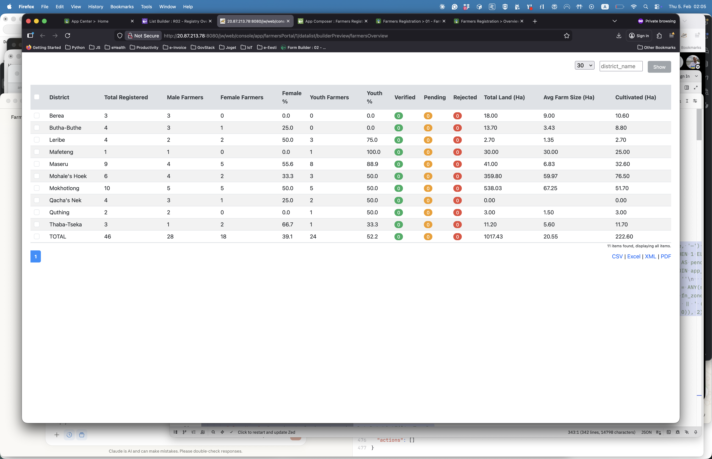
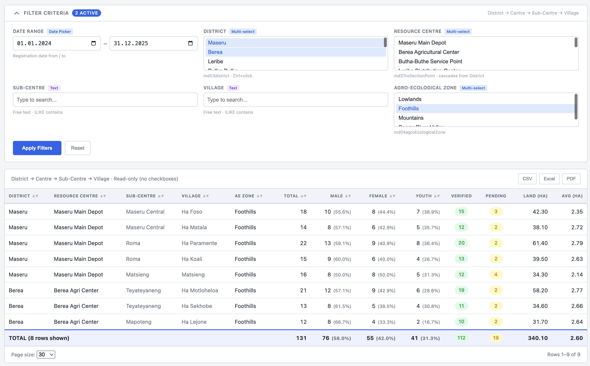

# Admin Guide

This guide covers installation and configuration of the Advanced Filters plugins for Joget DX 8.1+.

## Installation

1. Build the plugin bundle:
   ```bash
   mvn clean package
   ```
2. Upload `target/joget-advanced-filters-8.1.0.jar` via **Joget Admin > Settings > Plugin Manager > Upload Plugin**.
3. Verify the plugins appear in the DataList Builder filter type dropdown:
   - **Date Range Filter**
   - **MDM Multi-Select Filter**
   - **Filter Panel Decorator** (legacy)

---

## DateRangeFilterType

### When to Use

Use this filter when you need a **From/To date range on a single column** (e.g. registration date) within one filter cell. It also optionally provides the **collapsible filter panel** styling for the entire filter bar.

### Properties Reference

#### Date Range Configuration

| Property | Label | Required | Default | Description |
|---|---|---|---|---|
| `fromParamSuffix` | From Parameter Suffix | Yes | `date_from` | Filter name suffix for the From date. Becomes part of the encoded request parameter name. |
| `toParamSuffix` | To Parameter Suffix | Yes | `date_to` | Filter name suffix for the To date. Becomes part of the encoded request parameter name. |
| `defaultFromValue` | Default From Value | No | *(empty)* | Pre-populated From date in `YYYY-MM-DD` format. |
| `defaultToValue` | Default To Value | No | *(empty)* | Pre-populated To date in `YYYY-MM-DD` format. |

#### Filter Panel Styling

These properties activate the collapsible panel decorator. Leave `panelTitle` empty to disable panel wrapping.

| Property | Label | Required | Default | Description |
|---|---|---|---|---|
| `panelTitle` | Panel Title | No | `FILTER CRITERIA` | Title displayed in the panel header. Leave empty to disable panel wrapping entirely. |
| `panelColumns` | Grid Columns | No | `3` | Number of columns in the CSS grid layout for the filter bar. |
| `panelHierarchyHint` | Hierarchy Hint | No | `District -> Centre -> Sub-Centre -> Village` | Text shown on the right side of the panel header. |

### SQL Hash Variable Patterns

The Date Range Filter does not generate SQL itself (`getQueryObject()` returns `null`). Instead, it creates two encoded request parameters that you reference as hash variables in the JDBC binder SQL.

Given a DataList ID of `farmersOverview` (encoded as `5814095`) and default suffixes:

```sql
-- From date: inclusive (>=)
AND (NULLIF('#requestParam.d-5814095-fn_date_from?sql#', '') IS NULL
     OR fb.dateCreated >= NULLIF('#requestParam.d-5814095-fn_date_from?sql#', '')::timestamp)

-- To date: exclusive next day (<) to include the full "to" day
AND (NULLIF('#requestParam.d-5814095-fn_date_to?sql#', '') IS NULL
     OR fb.dateCreated < NULLIF('#requestParam.d-5814095-fn_date_to?sql#', '')::timestamp + INTERVAL '1 day')
```

Key points:
- Always use the `?sql` suffix in hash variables to prevent SQL injection.
- The `NULLIF(..., '')` pattern makes the filter a no-op when no value is submitted.
- Use `>= from` and `< to + INTERVAL '1 day'` for inclusive day-range semantics.

### Filter Panel Configuration

When `panelTitle` is set (non-empty), the Date Range Filter injects CSS and JavaScript that:

1. Wraps `form.filter_form` in a collapsible `.ro-filters-panel` div.
2. Adds a header with the panel title, a chevron toggle, and an active-filter count badge.
3. Converts the `div.filters` container into a CSS grid with the configured number of columns.
4. Shows `label.mobile_label` elements as uppercase filter labels (Joget hides these by default on desktop).
5. Adds type badges (Date Picker, Multi-select, Text) to each filter label.
6. Replaces the default submit button with styled **Apply Filters** and **Reset** buttons.
7. Hides the page-size selector cell.

The panel starts in the **open** state. Click the header to collapse/expand.

---

## MdmSelectFilterType

### When to Use

Use this filter for any column where selectable options come from an MDM lookup table (e.g. districts, resource centres, agro-ecological zones). The dropdown is populated at render time by querying the database directly, so it stays current as MDM data changes.

### Properties Reference

| Property | Label | Required | Default | Description |
|---|---|---|---|---|
| `tableName` | MDM Table Name | Yes | *(none)* | Table suffix. E.g. `md03district` queries `app_fd_md03district`. |
| `codeColumn` | Code Column | No | `c_code` | Column used as the option `value`. |
| `nameColumn` | Name Column | No | `c_name` | Column used as the option display label. |
| `size` | Visible Rows | No | `5` | Number of visible options in the `<select multiple>` dropdown. |
| `defaultValue` | Default Value | No | *(empty)* | Pre-selected values, semicolon-separated (e.g. `maseru;berea`). |

### How Multi-Select Works

1. The plugin renders a `<select multiple>` dropdown populated from the MDM table.
2. A hidden `<input>` field holds the submitted value.
3. On change (and on form submit), JavaScript syncs selected options into the hidden input as a **semicolon-separated string** (e.g. `maseru;berea;leribe`).
4. The JDBC SQL uses PostgreSQL's `string_to_array()` to split the value back into an array for filtering.

### SQL Hash Variable Pattern

```sql
AND (NULLIF('#requestParam.d-5814095-fn_district_name?sql#', '') IS NULL
     OR fl.c_district = ANY(string_to_array('#requestParam.d-5814095-fn_district_name?sql#', ';')))
```

- `string_to_array(value, ';')` splits the semicolon-joined string into a PostgreSQL array.
- `= ANY(...)` matches the column against any value in the array.
- The `NULLIF` wrapper makes the filter a no-op when empty.

### Platform-Aware Hint

The plugin displays a hint below the dropdown showing the MDM table name and multi-select instruction. It detects the user's platform and shows:
- macOS: `tableName · ⌘+click`
- Other: `tableName · Ctrl+click`

### Clear Button

A small **×** button appears next to each multi-select dropdown. Clicking it clears all selections in that filter only, without affecting other filters. The button is subtle (transparent) and turns red on hover.

---

## CascadingMdmSelectFilterType

### When to Use

Use this filter when you have **parent-child relationships** between MDM tables (e.g. District → Centre, where each Centre belongs to a District). The child filter automatically shows only options that match the selected parent values.

### Properties Reference

#### MDM Table Configuration

| Property | Label | Required | Default | Description |
|---|---|---|---|---|
| `tableName` | MDM Table Name | Yes | *(none)* | Table suffix. E.g. `md37collectionpoint` queries `app_fd_md37collectionpoint`. |
| `codeColumn` | Code Column | No | `c_code` | Column used as the option `value`. |
| `nameColumn` | Name Column | No | `c_name` | Column used as the option display label. |
| `parentCodeColumn` | Parent Code Column | No | *(empty)* | Column containing the parent's code (e.g. `c_district_code`). Required for child filters. |
| `size` | Visible Rows | No | `5` | Number of visible options in the dropdown. |
| `defaultValue` | Default Value | No | *(empty)* | Pre-selected values, semicolon-separated. |

#### Cascading Configuration

| Property | Label | Required | Default | Description |
|---|---|---|---|---|
| `parentFilterName` | Parent Filter Name | No | *(empty)* | The `name` of the parent filter (as configured in DataList Builder). Links this filter to its parent for cascading. |

#### Visual Grouping

| Property | Label | Required | Default | Description |
|---|---|---|---|---|
| `filterGroupName` | Filter Group Name | No | *(empty)* | Group identifier (e.g. `LOCATION`). Filters with the same group name are visually grouped together. |
| `filterGroupOrder` | Filter Group Order | No | `1` | Position within the group (1 = first/parent, 2 = second/child, etc.). |
| `filterGroupHint` | Filter Group Hint | No | *(empty)* | Hint text shown in the group header (e.g. `Select district first`). Only shown on the first filter in the group. |

### How Cascading Works

1. **Parent filter** is configured with `filterGroupName` and `filterGroupOrder=1`.
2. **Child filter** is configured with:
   - Same `filterGroupName`
   - `filterGroupOrder=2`
   - `parentFilterName` pointing to the parent filter's name
   - `parentCodeColumn` containing the FK to the parent table
3. When the page loads, child options have `data-parent-code` attributes.
4. JavaScript filters child options based on parent selection:
   - Unmatched options are hidden and disabled
   - Selecting a child auto-selects its parent if not already selected
5. The filters are visually grouped in a styled wrapper with a header and → arrows between them.

### Clear Button with Cascade

The clear button (×) on cascading filters also triggers a `change` event, which:
- For parent filters: causes child filters to show all options again
- For child filters: just clears the selection without affecting the parent

### Example: District → Centre

**District filter (parent):**
```
tableName: md03district
filterGroupName: LOCATION
filterGroupOrder: 1
filterGroupHint: Select district to filter centres
```

**Centre filter (child):**
```
tableName: md37collectionpoint
parentCodeColumn: c_district_code
parentFilterName: district_name
filterGroupName: LOCATION
filterGroupOrder: 2
```

---

## FilterPanelDecorator (Legacy)

> **Deprecation notice:** This standalone decorator requires binding to a SQL result column in the DataList Builder, which is awkward. Prefer using `DateRangeFilterType`'s built-in panel styling (set `panelTitle` property) instead.

### When You Might Still Need It

Only use this plugin if your DataList does **not** include a `DateRangeFilterType` filter but you still want the collapsible panel styling. If you already have a Date Range Filter, use its built-in panel properties instead.

### Properties Reference

| Property | Label | Required | Default | Description |
|---|---|---|---|---|
| `panelTitle` | Panel Title | No | `FILTER CRITERIA` | Title in the panel header. |
| `columns` | Grid Columns | No | `3` | Number of CSS grid columns. |
| `hierarchyHint` | Hierarchy Hint | No | `District -> Centre -> Sub-Centre -> Village` | Right-side header text. |

### Column Binding Workaround

The DataList Builder requires every filter to be bound to a SQL result column. Since this is a decoration-only plugin:

1. Add a column to your SQL that returns a constant (e.g. `'' AS panel_decorator`).
2. Bind the FilterPanelDecorator filter to that column.
3. Optionally hide the column in the DataList Builder.

This plugin must be the **last filter** in the DataList configuration so that all other filter cells exist in the DOM when its JavaScript runs.

---

## Complete Example: RPT-EXEC-001

The [RPT-EXEC-001 Registry Overview Dashboard](RPT-EXEC-001/RPT-EXEC-001-spec.md) uses these filters to provide a 6-filter dashboard for farmer registration statistics.

### Filter Configuration

| # | Filter Label | Plugin | Key Properties |
|---|---|---|---|
| 1 | Date Range | `DateRangeFilterType` | `fromParamSuffix=date_from`, `toParamSuffix=date_to`, `panelTitle=FILTER CRITERIA`, `panelColumns=3` |
| 2 | District | `MdmSelectFilterType` | `tableName=md03district` |
| 3 | Resource Centre | `MdmSelectFilterType` | `tableName=md37collectionPoint` |
| 4 | Sub-Centre | Built-in `TextFieldDataListFilterType` | *(default)* |
| 5 | Village | Built-in `TextFieldDataListFilterType` | *(default)* |
| 6 | Agro-Ecological Zone | `MdmSelectFilterType` | `tableName=md04agroEcologicalZone` |

### Before (Default Filter Bar)



### After (With Advanced Filters)



### JDBC Binder SQL Pattern

The full SQL is in [`RPT-EXEC-001/binder-sql.sql`](RPT-EXEC-001/binder-sql.sql). The WHERE clause follows this pattern for each filter:

```sql
WHERE 1=1
    -- Date range (from/to)
    AND (NULLIF('#requestParam.d-5814095-fn_date_from?sql#', '') IS NULL
         OR fb.dateCreated >= NULLIF('#requestParam.d-5814095-fn_date_from?sql#', '')::timestamp)
    AND (NULLIF('#requestParam.d-5814095-fn_date_to?sql#', '') IS NULL
         OR fb.dateCreated < NULLIF('#requestParam.d-5814095-fn_date_to?sql#', '')::timestamp + INTERVAL '1 day')

    -- Multi-select (semicolon-joined -> string_to_array)
    AND (NULLIF('#requestParam.d-5814095-fn_district_name?sql#', '') IS NULL
         OR fl.c_district = ANY(string_to_array('#requestParam.d-5814095-fn_district_name?sql#', ';')))

    -- Text search (ILIKE)
    AND (NULLIF('#requestParam.d-5814095-fn_sub_centre?sql#', '') IS NULL
         OR fl.c_sub_centre ILIKE '%' || '#requestParam.d-5814095-fn_sub_centre?sql#' || '%')
```

---

## Troubleshooting

### Filters don't filter (data doesn't change when filter values are submitted)

- Verify the hash variable names in your JDBC SQL match the encoded parameter names. The DataList ID is hashed by Joget's ParamEncoder (e.g. `farmersOverview` -> `5814095`). Check the HTML source for the actual `name` attributes on hidden inputs.
- Ensure you're using the `?sql` suffix on hash variables (e.g. `#requestParam.d-5814095-fn_date_from?sql#`).
- Confirm the `NULLIF(..., '') IS NULL` guard is present so the filter is skipped when empty.

### MDM dropdown is empty

- Check that the `tableName` property matches an existing table suffix. The plugin queries `app_fd_{tableName}`, so `md03district` queries `app_fd_md03district`.
- Verify the `codeColumn` and `nameColumn` properties match actual column names in the MDM table (defaults are `c_code` and `c_name`).
- Check the Joget server log for SQL errors from `MdmSelectFilterType`.

### Filter panel doesn't appear

- The panel is only injected when the `panelTitle` property on `DateRangeFilterType` is non-empty. Check the property value.
- If using the legacy `FilterPanelDecorator`, ensure it is the **last** filter in the DataList configuration.
- Check the browser console for JavaScript errors.

### Multi-select submits empty value

- The hidden input sync relies on JavaScript events (`change` and form `submit`). Check the browser console for JS errors.
- Verify the semicolon-separated value appears in the hidden input's `value` attribute before form submission (use browser DevTools).

### Date range default values don't appear

- Default values must be in `YYYY-MM-DD` format (e.g. `2024-01-01`).
- Defaults are only applied when the request parameter is empty (i.e. on first page load without filters applied).
